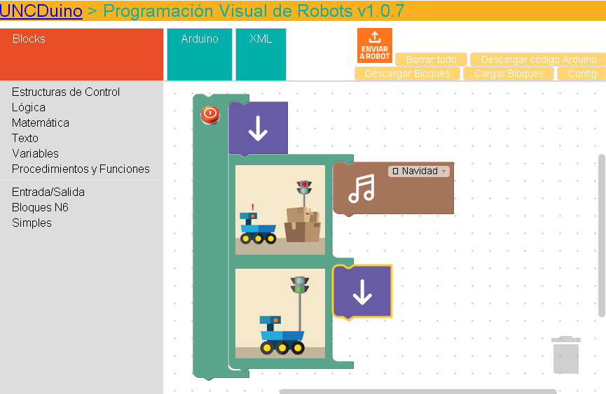
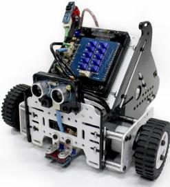

# UNCDuino

UNCDuino is a tool which is thought to help teachers in their effort to teach children to program using robots.

It provides a block-based language to code Arduino-based robots, and a feature to automatically upload into the robot the programs generated by the students (by click button ).

## Supported Boards

* [Multiplo](http://multiplo.org) Arduino DuinoBot v1.2 (tested with RobotGroup's Multiplo N6)
* [Multiplo](http://multiplo.org) Arduino DuinoBot v2.3 (tested with RobotGroup's Multiplo N6 Max)
* [Multiplo](http://multiplo.org) Tomy (In progress)

> Important note: Until [Multiplo](http://multiplo.org) doesn't release its HID Uploader v2.3 for linux, the automatic upload of the code (a.k.a the button ) **only works under windows**

## Online demo

* For now, an online demo is accessible in this URL: [https://uncmasmas.github.io/uncDuino/src/](https://uncmasmas.github.io/uncDuino/src/) (URL may change in the close future)

## Install (For teachers, students and general users)

1. [Download](https://github.com/uncmasmas/uncDuino/releases)
1. Extract
1. Run

Explanation:

* UNDuino-xxxx-Windows.zip: Complete version, with automatic upload. (Windows only)
* UNDuino-xxxx-Web.zip: Version without automatic upload (runs in every Operative System)

## Install (For Developers)

### Compile project (For Web)

1. Clone current repo
1. `make` command will do the trick.
1. The distributable web page, for now, is the content of the folder `src` (there you can find the index.html)

### Compile project (Executables for Windows and Linux)

> Important note: for now, **the compiling process** can only be performed from UNIX sistems (like linux or Mac).

1. Just **the first time**, download what you need using command `make packingSetup`. This will download NodeWebkit and ArduinoIDE versions for Linux and Windows.

From there, to make executables you must:

1. If you want, build the project again (using simply `make`)
1. Use the command `make packLinux` or `make packWindows` depending on the desired target OS executable.
1. The distributable executables will be under folder `compiled/windows` (for win) and `compiled/linux` (for linux).

Right now what `make pack...` does is:

* It packs the app using NodeWebkit (it generates an executable)
* It copies the entire arduinoIDE folder (heavy) to compiled/... . This is needed for the automatic upload  to work.

Future work: think how this process can be done more quickly.
